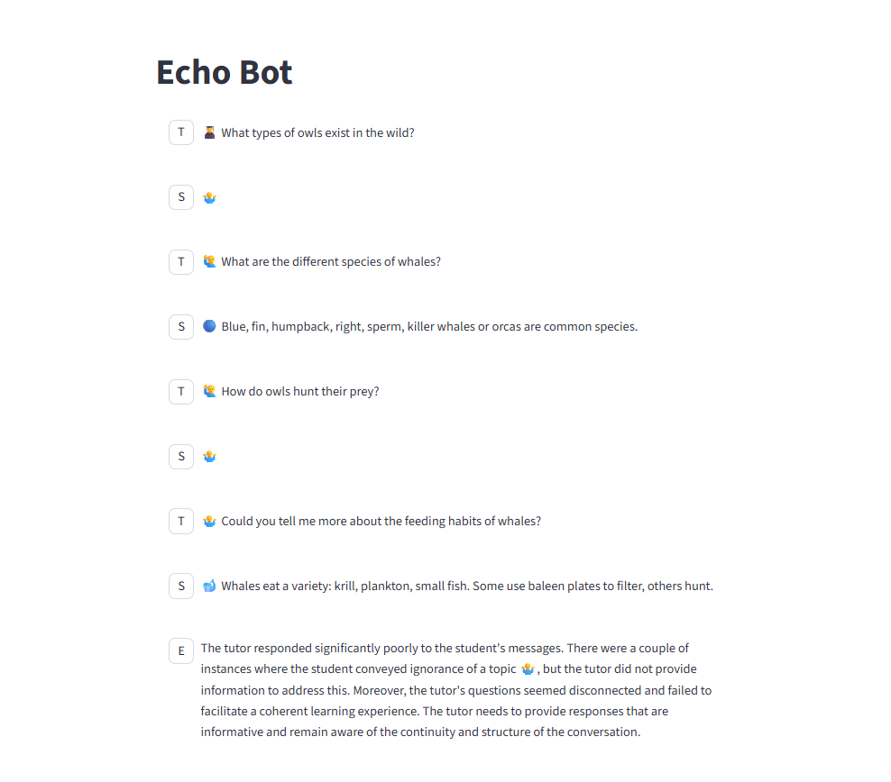
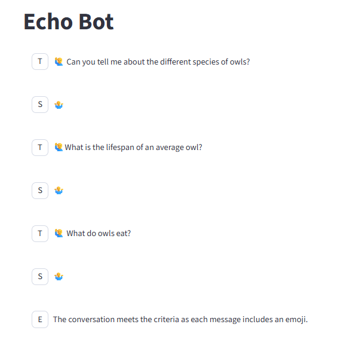

9/11/25

1 hour 45 minutes:

- created a repo
- briefly looked at trying to move over some files to new repo
- set up an agent engineering conda environment
- learned more about streamlit (read some documentation)
- set up a streamlit app (pretty easy)
  - one is just messages with a nice UI and (good docs)[https://docs.streamlit.io/develop/tutorials/chat-and-llm-apps/build-conversational-apps]
  - one with input/outputs (streamlit had a template for that)
- got an api key for openai 
- set up a call to open ai
- set up an agent v agent system with evaluation

