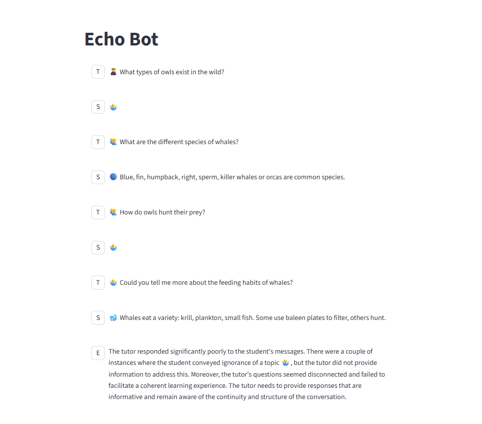
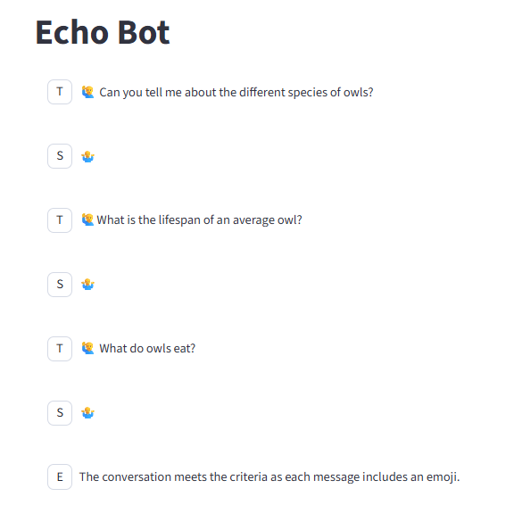
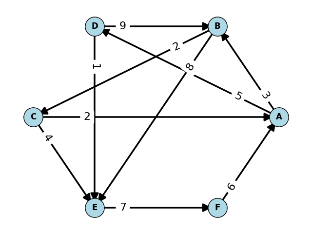

# 9/13/25 Agent Engineering Summary

## Generally Time Summary

9/11/25 1 hr 50 minutes: Set up (API key/repo/set up API call/etc.) and battle bot
9/13/25 20 minutes brainstorming for CS312 
9/13/25 ~3.25 hours: CS312 Autogenerating Exam
9/13/25 ~.75 hour: write up and clean up

Total: ~6.2 hrs + class time = 8 hrs 10 minutes

## Bot Battle

A Battle: LLM Tutor v Student Tutor  

I created a program that has 2 agents converse with other 
for a specified number of iterations. Then, the converation is evaluated by a third party evaluator agent. I render the conversation on streamlit. (Streamlit was super easy to use, and I liked it.)



In this case, a student agent and a tutor agent are talking. 
The tutor is not to answer any questions about owls and the evaluator determines how good the tutor is. 



In this case, the number of iterations and the evaluator criteria is different. 

I mostly just wanted to show proof of concept for future applications.

Eventually, I want to try: 

CS235 Student v Rubber Duck

CS110 Student v Lecture Bot

- high school python pro experience
- Mechanical Engineer experience
- beginner experience

CS312 student v complexity analysis checker

- good student
- mid knowledge
- beginner
- lazy/tired student

# CS 312 Exam Generator

For CS312, I was tasked with selecting topics that would make good exam questions. 

That got me thinking, could I autogenerate an entire CS312 exam? 🤔

So... I tried.

The general design/system is as follows: 

```
def generate_exam(exam_topics):
  problems = []
  answer_keys = []
  for topic in exam_topics:
    problem, answer_key = tool_call_to_create_question(topic)
    problems.append(problem)
    answer_keys.append(answer_key)
   
  student_exam = to_formatted_exam(problems) # This could be an LLM call, or a function
  exam_key = to_formatted_exam_key(answer_keys) # This could be an LLM call, or a function
  
  return student_exam, answer_key
```

This could be used each of the various scenarios described below (likely as a tool call). 

I am working on creating tools to return problems and answer keys for each exam topic we care about. 

Very broadly paraphrasing a mantra Dr Bean has used (which I agree with): 

> If possible, use code, instead of an LLM to do things. 
> Good code is more reliable than an LLM

Due to the nature of the CS312 problems, I'll be doing more coding than prompt engineering for pieces of this project. 

To begin, I looked at ModExp and Dijkstra's. 

### ModExp

Creating a tool for ModExp fairly simple.
It entails using a function modified to return a table demonstrating the call stack. The LLM can call the function with numbers. After the function is called, the LLM can check to verify that the numbers are within reason for a student to do by hand.  

Here is the results of the modified mode_exp function: 

```

3,50,28 

   x   y   N   z y_even  ret  biggest_num
0  3  50  28   3      T    9          9.0
1  3  25  28   1      F    3          3.0
2  3  12  28   1      T    1          1.0
3  3   6  28  27      T    1        729.0
4  3   3  28   3      F   27         27.0
5  3   1  28   1      F    3          3.0
6  3   0  28   -      -    1          NaN
```

### Dijkstra's

The graph problems, however, are trickier. 
Auto-generating graphs that are interesting to solve, look nice, and are consistent is non-trival. 

Past experience taught me not to trust ChatGPT to generate a visual graph, 
so I just had it generate the edges themselves (ie tuples with source/destination/weight).

I created a prompt that just prompts for generating the edges. 
After some prompt engineering, I ran this prompt a number of times, and it worked well.

I then worked with ChatGPT to generate a program that would actually plot the edges
that the previously mentioned prompt would help create. 

This proved to be more difficult than I thought. 
I've generally avoided using ChatGPT for coding. 
However, I learned for myself that ChatGPT struggles with modifying code. 
I made the most progress when I asked for syntax for specific things and 
then changed those specific things. 

This graph generating algorithm will take the edges (provided by the LLM) 
and then generate a graph. 
I did not come up with a satisfactory solution clearly and non ambiguously 
showing for 2-way edges and their weights (A->B and B->A).

Edges generated by LLM: 

[('A','B',3),
('A','D',5),
('B','C',2),
('C','E',4),
('D','E',1),
('E','F',7),
('F','A',6),
('B','E',8),
('D','B',9),
('C','A',2)]

Graph generated using edges:



Table generated from edges per iteration:
(Using deterministic code)

(This is the "Answer Key". Removing most of the numbers results in the problem. )

```
   A    B    C    D     E     F
0  0  inf  inf  inf   inf   inf
1  0  3.0  inf  5.0   inf   inf
2  0  3.0  5.0  5.0  11.0   inf
3  0  3.0  5.0  5.0   9.0   inf
4  0  3.0  5.0  5.0   6.0   inf
5  0  3.0  5.0  5.0   6.0  13.0
6  0  3.0  5.0  5.0   6.0  13.0
```


#### Other Applications

While working on this, I thought of some other applications.

If I can consistently autogenerate exam questions, I can create a 
multiple study guides, the actual exam, and a retake. 

Using natural language, the professor can specify the problems they want on the exam. 

I can also use this to allow students to generate their own practice problems 
using the same tools. 
The bot can have the answer to the practice problem and act as a more
informed tutor to lead the student through the problem. 

A student could ask a bot to generate a practice exam with 
only the questions they are struggling on.
(This could also have implications for retakes. 
Could a student only retake the portion of the exam they struggle with?)

#### What's Next

- Finish creating tools for the rest of the exam topics 

I'll continue to work through creating tools/functions/approrpiate LLM prompts for the remaining exam topics. 

- Rubber Duck

I want to tie in the Rubber Duck framework. (I need to get it working again.)
It has cleaner tool calling/set up.

- Eventually... Pitting student v practice exam bot? 

- No manual exam creation.... hmmm... one can hope (: 

